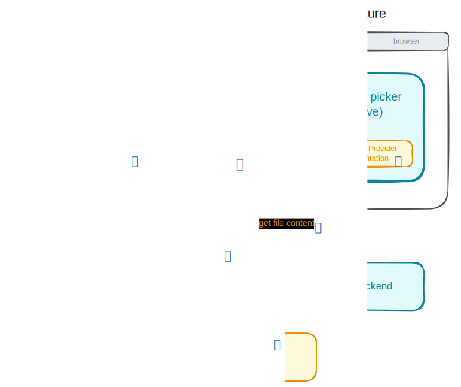
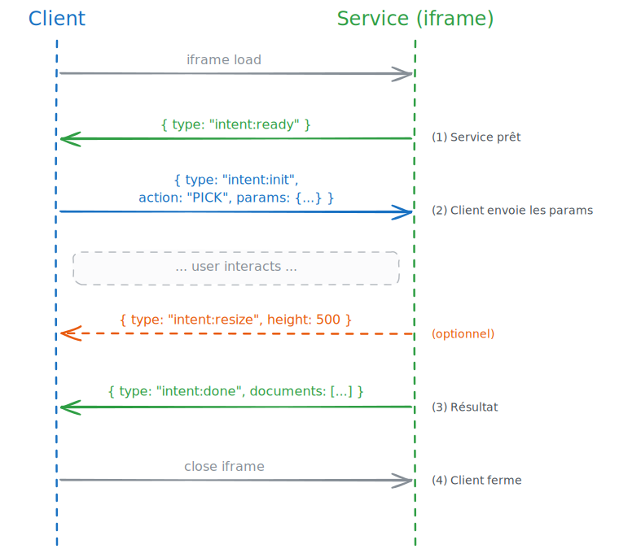

# Open Buro — File Picker

**The first standard of the Open Buro suite.**

| | |
|---|---|
| **Status** | Draft / Beta — Editor's Draft |
| **This version** | 0.1 (June 2026) |
| **Standard suite** | Open Buro — European Workplace Orchestration Standard |
| **Topic** | File Picker (first topic) |
| **Editors & contributors** | Listed alphabetically below — see [Contributors](#contributors). |
| **Origin** | Open Buro TechSprint #01 — File Picker, April 2026 |
| **License** | CC BY-SA 4.0 |
| **Project** | <https://openburo.eu> · <https://github.com/openburo> |

---

## Contributors

Listed alphabetically by surname.

| Name | Organisation | GitHub | Email |
|---|---|---|---|
| Benjamin André | LINAGORA | [Benibur](https://github.com/Benibur) | bandre@linagora.com |
| Stephan Bergmann | Collabora Productivity | [stbergmann](https://github.com/stbergmann) | stephan.bergmann@collabora.com |
| Jaime Conde Segovia | Univention | — | conde-segovia@univention.de |
| Thibaud Delobelle | Oriatec | — | thibaud.delobelle@oriatec.fr |
| Manuel Leduc | XWiki | [manuelleduc](https://github.com/manuelleduc) | manuel.leduc@xwiki.com |
| Samuel Paccoud | DINUM / La Suite numérique | — | samuel.paccoud@numerique.gouv.fr |
| Théo Poizat | LINAGORA | [zatteo](https://github.com/zatteo) | tpoizat@linagora.com |
| Viktor Pracht | Open-Xchange | [VP-](https://github.com/VP-) | viktor.pracht@open-xchange.com |
| Éloi Rivard | LaSuite.coop / Yaal coop | [azmeuk](https://github.com/azmeuk) | eloi@yaal.coop |

> **`TODO`** — Add the remaining first-TechSprint participants not yet listed above (and confirm the two organisations inferred from email domains: Manuel Leduc → XWiki, Thibaud Delobelle → Oriatec).

---

## Abstract

Open Buro is an open standard that **platformises independent digital services** — it orchestrates separately-built applications into a coherent workplace that delivers a *Smart Platform Experience*, rather than a mere catalogue of apps behind a single sign-on.

The **File Picker** is the first Open Buro standard. It defines a protocol that lets a *consumer* application (mail, docs, chat, calendar…) cast an *intent* asking a *provider* application (a drive such as Twake Drive, LaSuite Drive, Nextcloud…) to present a file-selection widget and return the result in a predefined format. The provider supplies its own file picker frontend; the consumer application doesn't need to implement anything for the user to benefit from the provider's full navigation (search, favourites, recents, tags…).

This document is the **explanatory specification** of the File Picker: its purpose, terminology, architecture, and the intent lifecycle. The deep normative artefacts (the formal manifest JSON Schema, the exhaustive `postMessage` message exchanges, the error registry, and the security model) are presented here at the architectural level and **reserved** for iterative refinement; the sections that hold them are marked `[RESERVED]`.

---

## Status of This Document

This is an **Editor's Draft**. Open Buro and its File Picker standard are in **beta**. The protocol described here was validated in practice during the April 2026 TechSprint, where four independent providers (Jalios, a WebDAV picker, LaSuite Drive and Twake Drive) interoperated against a shared capabilities registry.

This document **supersedes** the earlier hackathon working note (`open-buro-dossier-technique-file-picker.md`) as the canonical entry point for the File Picker. The comparative survey of prior art from that note has been distilled into **Appendix A** as non-normative rationale.

Sections marked `[RESERVED]` are **not yet normative**. They name the artefact to be produced and scope it, so that implementers know what is settled and what is still open. Following the project's working principle — *when a generalisation is simple, integrate it directly; otherwise postpone it and say so* — open points are flagged inline rather than silently resolved.

---

## Table of Contents

[Abstract](#abstract) · [Status of This Document](#status-of-this-document) · [Contributors](#contributors)

1. [Terminology and Conventions](#1-terminology-and-conventions)
2. [Functional Overview](#2-functional-overview)
3. [Use Cases — value proposition](#3-use-cases--illustrating-the-value-proposition)
4. [Personas and Audience](#4-personas-and-audience)
5. [Architecture](#5-architecture)
6. [The Intent Lifecycle](#6-the-intent-lifecycle)
7. [Capabilities Reference — PICK, SAVE](#7-capabilities-reference--pick-save)
8. [Scope and Assumptions](#8-scope-and-assumptions)
9. [Security Considerations](#9-security-considerations)
10. [Implementation Resources (How-tos)](#10-implementation-resources-how-tos)
11. [Open Items — the road to a normative specification](#11-open-items--the-road-to-a-normative-specification)
- [Appendix A — Prior Art and Rationale](#appendix-a--prior-art-and-rationale-non-normative)
- [Appendix B — Mapping from earlier terminology](#appendix-b--mapping-from-earlier-terminology)
- [References](#references)

---

## 1. Terminology and Conventions

### 1.1 Requirement keywords

The key words **MUST**, **MUST NOT**, **SHOULD**, **SHOULD NOT**, and **MAY** are to be interpreted as described in [RFC 2119] and [RFC 8174] when, and only when, they appear in all capitals. In this Editor's Draft they are used where a requirement is already firm from the TechSprint; requirements still under refinement live in `[RESERVED]` sections.

### 1.2 Core terms

| Term | Definition |
|---|---|
| **Consumer** | The application that initiates a file-picking interaction by casting an intent (e.g. a mail or document editor). It does not implement the file picking interface. |
| **Provider** | The application that exposes a file-picking widget and resolves the intent (e.g. a drive). It supplies its own frontend. |
| **Capability** | A declared ability of a provider to handle a class of intent — for the File Picker: `PICK` or `SAVE`. |
| **Intent casting** | The act, by a consumer, of broadcasting a request for a capability and letting the platform resolve it to one or more providers. |
| **Capabilities manifest** | The standard-format document in which an application declares its capabilities (see §5.2). |
| **Capability chooser** | The UI shown to the end-user when several providers expose the requested capability. Implementing it is the consumer's responsibility; Open Buro offers a shared standard implementation. |
| **Open Buro Bridge** | The reference client library that handles the consumer side of the intent lifecycle (discovery, resolution, iframe and `postMessage` orchestration, response management). |
| **Platform registry** | The service (the "Open Buro server") that lists the capabilities exposed by the applications of a given workplace. |
| **Workplace / Platform** | The set of applications orchestrated together under one administration. |
| **Interop environment** | A broader setting in which applications from different organisations interoperate, with administrators of limited control (see §8.3). |
| **End-user / Workplace administrator / Application developer** | The three personas (see §4). |

> **Note on terminology lineage.** The April working note used an Android-flavoured vocabulary (*client, service/source, intent-filter, ob_bridge, chooser*). This standard fixes the canonical terms above. A full mapping is given in **Appendix B**, and all examples in this document — including manifest snippets — use the canonical terms.

---

## 2. Functional Overview

### 2.1 What the File Picker does

The Open Buro File Picker is a protocol that lets a **consumer** cast an **intent** asking to open a file picker served by a **provider**. From the end-user's standpoint: while attaching a file in a mail client (consumer), the user is presented with their drive's (provider's) own picker, browses it natively, selects a file, and the result flows back into the mail client.

Defining properties:

- The **picker frontend is supplied by the provider**. The consumer does not implement any user interface.
- All of the provider's navigation features (search, favourites, recents, tags…) are **automatically available**.
- The picker interface is **homogeneous** from one consumer to the next — it is the provider's file picker, regardless of the consumer from which it is being invoked.
- The picker UX remains **visually distinct** from the consumer, so the user understands they are momentarily in the provider and that the consumer does not see the provider's contents.
- A consumer can **list the providers** that expose a file-picker capability — `PICK` or `SAVE`.

### 2.2 Roles at a glance

| Role | Responsibility |
|---|---|
| **Consumer** | Casts the intent; drives the lifecycle (with the Open Buro Bridge); consumes the response. |
| **Provider** | Declares its capabilities; serves the picker frontend; returns the result over `postMessage`. |
| **Platform registry** | Exposes the list of available capabilities for the workplace. |
| **Open Buro Bridge** | Reference implementation of the consumer-side lifecycle. |
| **Capability chooser** | Lets the user pick among several matching providers. |

<!-- excalidraw src="src/diagrams/consumer-provider-architecture.excalidraw" alt="Consumer/provider architecture" sha256="52258ff15c8cb630151c7ace4d5b25ce6b62ed1d11b6b720ee95e4795ed0164a" -->
[](src/diagrams/consumer-provider-architecture.excalidraw)
<!-- /excalidraw -->

---

## 3. Use Cases — illustrating the value proposition

The following use cases motivate the standard's design and illustrate the value of a *Smart Platform Experience* over a mere SSO portal. Each maps to capabilities and properties declared by providers and consumers; points still open are flagged `TODO`.

1. **Reopen on a given context.** The picker can reopen at a previously visited location (e.g. the last folder used) rather than at the provider's root every time. The provider returns an opaque *context* token with its response; the consumer stores it and passes it back on the next cast, so the user resumes where they left off. The context is opaque to the consumer and interpreted only by the provider.

2. **Switch provider (drive) dynamically.** Within a single picking flow, the end-user can switch from one provider to another without restarting — e.g. from the capability chooser, or via a "change drive" affordance — so a user with several drives is not locked into the first one. `TODO`: confirm whether switching happens only at the capability-chooser level, or also live inside an already-open picker session.

3. **MIME-type adaptation.** The consumer declares the accepted `mimeTypes`; the provider adapts its picker accordingly — for example a gallery / thumbnail view when only images are requested — improving the selection experience.

4. **Dual return: share link + download link.** A `PICK` response can return several link forms at once — typically a share link and a direct download link — so the consumer can choose per payload (e.g. embed a small payload, link a large one). The provider announces which link forms it supports in its capabilities (§5.2). This refines the response-by-reference mode of §6.

5. **Encrypted content (raw-data transfer).** A consumer can `PICK` or `SAVE` a file that is encrypted on the provider. In that case the transfer is performed **by raw data (by value)** rather than by URL, so the content can be decrypted in the appropriate context rather than served from a link. `TODO`: specify the decryption boundary — where the keys live and which side decrypts — in coordination with the platform end-to-end vault and the §9 security model.

6. **Simple authentication.** Opening the provider's picker reuses the user's existing workplace session (SSO), so no re-authentication is required when the provider iframe loads. `TODO`: specify the session/token mechanism the provider relies on inside the iframe (to be defined with §9).

7. **Automatic iframe rights management.** The platform automatically grants the embedding rights the provider iframe needs inside the consumer — it opens the consumer's CSP (`frame-src`) for whitelisted providers and sets the appropriate iframe permissions — so developers and administrators do not configure this by hand for every consumer/provider pair. See the consumer how-to (§10) and the §9 security model.

---

## 4. Personas and Audience

| Persona | Role |
|---|---|
| **End-user** | Uses the consumer and provider applications. |
| **Workplace administrator** | Deploys and configures the applications. |
| **Application developer** | Builds consumer or provider applications. |

**This document addresses workplace administrators and application developers.** The product ambition remains centred on the end-user: an integrated, fluid and productive journey.

---

## 5. Architecture

### 5.1 Components

A File Picker exchange involves a **consumer**, one or more **providers**, a **platform registry** that advertises capabilities, and — on the consumer side — the **Open Buro Bridge** and the **capability chooser**.

### 5.2 The capabilities manifest

Every application in the ecosystem — consumer or provider — **MUST** declare its capabilities in a **capabilities manifest** the format of which is part of the standard. Providers declare the file-picker capabilities they serve in the following format:

```json
{
  "id": "twake-drive-filepicker",
  "name": "Twake Drive File Picker",
  "url": "https://drive.example.eu/openburo.json",
  "version": "0.0.1",
  "display": "modal",
  "capabilities": [
    {
      "action": "PICK",
      "properties": { "mimeTypes": ["*/*"], "multiple": true },
      "path": "https://drive.example.eu/capabilities/PICK"
    },
    {
      "action": "SAVE",
      "properties": { "mimeTypes": ["*/*"] },
      "path": "https://drive.example.eu/capabilities/SAVE"
    }
  ]
}
```

Field intent: `id`/`name`/`version` identify the provider; `url` locates the capabilities manifest itself; each entry in `capabilities[]` binds an `action` (`PICK` | `SAVE`) to a `path` (the frontend surface to embed) and a set of `properties` (e.g. accepted `mimeTypes`, `multiple`); optional `display` hints at presentation (e.g. `modal`).

> `[RESERVED]` **Manifest JSON Schema.** A formal JSON Schema (types, required fields, allowed `properties` per action, extensibility rules, versioning policy) will be produced as a normative artefact. The snippet above is illustrative.

### 5.4 The platform registry (discovery)

The list of available capabilities is served by a minimal **platform registry** (the "Open Buro server") that exposes the capabilities of the workplace's applications. A consumer queries it to discover which capabilities the providers support: `PICK` or `SAVE`.

**Out of scope (see §8.1):** *how* applications come to know the link to each other's capabilities manifest. A static configuration and a dynamic registry are both legitimate; the discovery transport is not constrained here.

### 5.5 The Open Buro Bridge

The consumer is responsible for the full intent lifecycle. Open Buro provides a reference library, the **Open Buro Bridge**, that implements it so consumers do not re-write it. The Bridge:

- knows the capabilities available on the platform (via the registry);
- resolves an intent to one or more capabilities (resolver + capability chooser);
- drives the provider iframe over its lifecycle (sizing, bidirectional message handling, teardown);
- returns the response to the consumer through a callback.

An **illustrative** consumer-side API (final reference reserved):

```js
// Illustrative only — see [RESERVED] below for the normative API.
const bridge = new OpenBuroBridge({ registry: "https://platform.example.eu" });

const result = await bridge.cast({
  action: "PICK",
  accept: ["image/*", "application/pdf"],
  multiple: true
});
// result.documents -> [{ id, name, mimeType, url, size }, ...]
```

> `[RESERVED]` **Open Buro Bridge — normative API reference.** The method surface, configuration options, framework bindings, and conformance expectations of the Bridge will be specified separately. The sketch above only conveys intent.

### 5.6 The capability chooser

When several providers expose the requested capability, the end-user must be able to choose. Implementing the chooser is the **consumer's responsibility**, but Open Buro ships a **shared standard implementation** so consumers can adopt a consistent, accessible chooser instead of building their own.

---

### 5.3 Application manifest generated reference

*An Application manifest is the array of applications a consumer fetches in order to discover and resolve capabilities.*

#### Items

- <a id="items"></a>**Items**: Refer to *[#/$defs/application](#%24defs/application)*.
#### Definitions

- <a id="%24defs/application"></a>**`application`** *(object)*: An application that provides one or more capabilities. Cannot contain additional properties.
  - <a id="%24defs/application/properties/id"></a>**`id`** *(string, required)*: Unique, stable, technical identifier for the application, in reverse-DNS notation (lowercase, dot-separated, at least two labels). Must match pattern: `^[a-z0-9]([a-z0-9-]*[a-z0-9])?(\.[a-z0-9]([a-z0-9-]*[a-z0-9])?)+$` ([Test](https://regexr.com/?expression=%5E%5Ba-z0-9%5D%28%5Ba-z0-9-%5D%2A%5Ba-z0-9%5D%29%3F%28%5C.%5Ba-z0-9%5D%28%5Ba-z0-9-%5D%2A%5Ba-z0-9%5D%29%3F%29%2B%24)).

    Examples:
    ```json
    "com.twake.drive-filepicker"
    ```

    ```json
    "eu.openburo.webdav-filepicker"
    ```

    ```json
    "io.cozy.files"
    ```

  - <a id="%24defs/application/properties/name"></a>**`name`** *(string, required)*: Human-readable display name, e.g. shown in a chooser when several applications match. Can be used by screen readers. Default when no localization is available. Length must be at least 2.

    Examples:
    ```json
    "Twake Drive File Picker"
    ```

  - <a id="%24defs/application/properties/localizedName"></a>**`localizedName`** *(object)*: Localized display names keyed by BCP 47 language tag. Number of properties must be at least 1. Can contain additional properties.
    - <a id="%24defs/application/properties/localizedName/additionalProperties"></a>**Additional properties** *(string)*: Length must be at least 2.

    Examples:
    ```json
    {
        "en": "Twake Drive File Picker",
        "fr": "S\u00e9lecteur de fichiers Twake Drive"
    }
    ```

  - <a id="%24defs/application/properties/url"></a>**`url`** *(string, format: uri)*: Application base URL. Used for CSP and message origin verification.

    Examples:
    ```json
    "https://drive.example.com/"
    ```

  - <a id="%24defs/application/properties/manifestVersion"></a>**`manifestVersion`** *(string)*: Version of this manifest entry's format, used by the consumer to know how to parse the entry. This is not the application's own version number. A single manifest may mix applications of different format versions. Length must be at least 1.

    Examples:
    ```json
    "1"
    ```

  - <a id="%24defs/application/properties/icon"></a>**`icon`** *(string, format: uri)*: Optional URL to the application's icon, shown in the chooser when several applications match.

    Examples:
    ```json
    "https://drive.example.com/favicon.svg"
    ```

  - <a id="%24defs/application/properties/capabilities"></a>**`capabilities`** *(array, required)*: The actions this application can perform. Length must be at least 0.
    - <a id="%24defs/application/properties/capabilities/items"></a>**Items**: Refer to *[#/$defs/capability](#%24defs/capability)*.
- <a id="%24defs/capability"></a>**`capability`** *(object)*: A single action an application can perform. Cannot contain additional properties.
  - <a id="%24defs/capability/properties/action"></a>**`action`** *(string, required)*: The action this capability performs. The consumer uses it to match capabilities to the user's intent and may group capabilities by action in the chooser UI. Reserved actions: `PICK` - the consumer asks the application for one file, many files, or a folder. `SAVE` - the consumer sends one file, many files, or a folder to the application. `SHARE` - the consumer asks the application for a shareable URL to a document. Consumers must ignore capabilities whose action they do not recognize.
    - **Any of**
      - <a id="%24defs/capability/properties/action/anyOf/0"></a>: Actions reserved by this specification. Must be one of: "PICK", "SAVE", or "SHARE".
      - <a id="%24defs/capability/properties/action/anyOf/1"></a>: Custom actions should carry a vendor prefix (e.g. `ACME_PUBLISH`); un-prefixed names are reserved for future versions of this specification. Must match pattern: `^[A-Z][A-Z0-9_]*$` ([Test](https://regexr.com/?expression=%5E%5BA-Z%5D%5BA-Z0-9_%5D%2A%24)).

    Examples:
    ```json
    "PICK"
    ```

    ```json
    "SAVE"
    ```

    ```json
    "SHARE"
    ```

    ```json
    "ACME_PUBLISH"
    ```

  - <a id="%24defs/capability/properties/path"></a>**`path`** *(string, format: uri, required)*: Endpoint that fulfils this capability. Absolute URL. Should return a UI for the user to pick or save files, and then return the picked or saved file(s) to the consumer.

    Examples:
    ```json
    "https://drive.example.com/capabilities/filePicker.jsp"
    ```

  - <a id="%24defs/capability/properties/iframeAllow"></a>**`iframeAllow`** *(array)*: Permissions Policy features the application needs when opened in an iframe. The consumer uses this list to build the iframe `allow` attribute. When omitted, the application needs no extra features. Ignored for non-iframe targets.
See https://developer.mozilla.org/en-US/docs/Web/HTML/Reference/Elements/iframe#allow. Length must be at least 1. Items must be unique.
    - <a id="%24defs/capability/properties/iframeAllow/items"></a>**Items**: Refer to *[#/$defs/permissionsPolicyFeature](#%24defs/permissionsPolicyFeature)*.

    Examples:
    ```json
    [
        "clipboard-read",
        "clipboard-write"
    ]
    ```

    ```json
    [
        "camera",
        "microphone",
        "geolocation"
    ]
    ```

  - <a id="%24defs/capability/properties/mimeTypes"></a>**`mimeTypes`** *(array)*: MIME filters the capability accepts (e.g. any file, or only images for a gallery). When omitted, the consumer falls back to the catch-all pattern accepting any file type. Not used outside of file-picking, saving or sharing capabilities. Length must be at least 1. Default: `["*/*"]`.
    - <a id="%24defs/capability/properties/mimeTypes/items"></a>**Items**: Refer to *[#/$defs/mimePattern](#%24defs/mimePattern)*.
  - <a id="%24defs/capability/properties/multiple"></a>**`multiple`** *(boolean)*: Whether the capability can pick or save multiple files. Only used for file-picking or saving capabilities. Default: `false`.
- <a id="%24defs/permissionsPolicyFeature"></a>**`permissionsPolicyFeature`** *(string)*: A Permissions Policy directive name, as used in the iframe `allow` attribute (lowercase, hyphen-separated).
See https://developer.mozilla.org/en-US/docs/Web/HTTP/Headers/Feature-Policy#directives. Must match pattern: `^[a-z]+(-[a-z]+)*$` ([Test](https://regexr.com/?expression=%5E%5Ba-z%5D%2B%28-%5Ba-z%5D%2B%29%2A%24)).

  Examples:
  ```json
  "clipboard-read"
  ```

  ```json
  "clipboard-write"
  ```

  ```json
  "geolocation"
  ```

  ```json
  "camera"
  ```

  ```json
  "microphone"
  ```

  ```json
  "fullscreen"
  ```

- <a id="%24defs/mimePattern"></a>**`mimePattern`** *(string)*: A full MIME type, a subtype wildcard (image/*), or the catch-all wildcard matching any type. Must match pattern: `^(\*/\*|[A-Za-z0-9][A-Za-z0-9!#$&^_.+-]*/(\*|[A-Za-z0-9][A-Za-z0-9!#$&^_.+-]*))$` ([Test](https://regexr.com/?expression=%5E%28%5C%2A/%5C%2A%7C%5BA-Za-z0-9%5D%5BA-Za-z0-9%21%23%24%26%5E_.%2B-%5D%2A/%28%5C%2A%7C%5BA-Za-z0-9%5D%5BA-Za-z0-9%21%23%24%26%5E_.%2B-%5D%2A%29%29%24)).

  Examples:
  ```json
  "*/*"
  ```

  ```json
  "image/*"
  ```

  ```json
  "application/pdf"
  ```

---

## 6. The Intent Lifecycle

The consumer owns the lifecycle: **intent cast → retrieve capabilities → capability chooser → iframe + `postMessage` setup → iframe layout → response management**. The Open Buro Bridge implements these steps.

The provider and consumer establish a channel over `window.postMessage`. The validated message flow is:

```
Consumer                                  Provider (iframe)
   |                                            |
   |  -- load iframe (capability path) ------->  |
   |  <----------- { type: "intent:ready" } ---  |   (1) provider ready
   |  -- { type: "intent:init",                  |
   |       action: "PICK",                       |
   |       params: { multiple: true,             |   (2) consumer sends params
   |                 accept: ["image/*"] } } -->  |
   |              ... user browses & selects ...  |
   |  <-- { type: "intent:resize", height } ----  |   (optional) layout hint
   |  <-- { type: "intent:done",                  |
   |        documents: [ ... ] } --------------   |   (3) result
   |  -- close iframe ------------------------->  |   (4) consumer tears down
```

Illustrative result message (`PICK`, returned by reference):

```json
{
  "type": "intent:done",
  "action": "PICK",
  "documents": [
    {
      "id": "abc-123",
      "name": "report.pdf",
      "mimeType": "application/pdf",
      "url": "https://drive.example.eu/share/abc-123?token=xyz",
      "size": 245000
    }
  ]
}
```

Terminal messages also include `intent:cancel` and `intent:error` (with an error code such as `user_cancelled`, `permission_denied`, `not_found`, `size_exceeded`, `unknown`).

A consumer that receives messages **MUST** validate `event.origin` before acting on them.

<!-- excalidraw src="src/diagrams/protocol-postmessage-v1.excalidraw" alt="postMessage protocol V1" sha256="f59a8dc308d636869f478127bdbfdb28206402e9adad79b4947b6cdd410fe181" -->
[](src/diagrams/protocol-postmessage-v1.excalidraw)
<!-- /excalidraw -->

> `[RESERVED]` **Normative `postMessage` message catalogue.** The complete, normative catalogue — every message type, its direction, required and optional fields, the canonical `document` object schema, the response modes (by reference vs by base64 content), size limits, and the error-code registry — will be specified as a normative artefact. The flow and payloads above are illustrative distillations of the TechSprint draft.

---

### 6.1 Message sequence details

See [sequence-messaging.schema.json](src/schemas/sequence-messaging.schema.json) for the schema of the messages.

#### intent:init

```jsonc
{
    "type": "intent:init",  // Message between provider to consumer
    "payload": {},
    "": {}
}
```

#### intent:resize

This message is optional, not of mandatory use by the consumer. Not mandatory to send by the provider.
Do not wait for this message to arrive nor be sent.

```jsonc
{
    "type": "intent:resize",  // This message is from the provider to the consumer
    "payload": {
        "width": 800,
        "height": 600
    },
    "": {}
}
```

#### intent:progress

Very likely we will need to have it for chunking large files.

#### intent:done

> Handled by others

Worth adding a flag for the last message,
so multiple `intent:done` messages can be sent
(for streaming documents as they are downloaded)

### 6.2 postMessage answer formats

```json
{
  "type": "intent:done",
  "action": "PICK",
  "documents": [
    {
      "id": "abc-123",
      "name": "report.pdf",
      "mimeType": "application/pdf",
      "url": "https://drive.example.com/share/abc-123?token=xyz",
      "size": 245000
    }
  ]
}
```

TODO: resize message
TODO: check Google File Picker API for use cases
TODO: error for unsupported transfer mode
TODO: consumer can request preview size

#### Message Definitions

This section defines the contents of all `postMessage` messages.

TODO: define top-level structure:
```json
{
  "sourceId": "123", // file picker ID from the init parameters, to support multiple simultaneously open file pickers
  "type": "intent:done", // do we need the `intent:` prefix?
  "documents": [ … ]
}
```

The elements of the `documents` array depend on various circumstances, even for the same initial action.

##### Common Data in Responses

Response messages which contain the results of the file picker have several common fields, which describe the picked data. They are described here once.

Mandatory fields
* `id`: string, unique identifier of this document. Reserved for future uses.
* `name`: string, name of the file
* `mimeType`: string, the MIME type of the file. If unknown, should be specified as `application/octet-stream`.
* `size`: number, file size in bytes

Optional fields might be missing.
* `lastModified`: Date, last modified timestamp
* `created`: Date, the timestamp when the file was created
* TODO: version (from WebDAV), to preserve versioning information if relevant and possible.
* Alternative: etag: any hash likely to identify the file content.
* `preview`: A small image useful for previews. A nested `document`-like object with a small subset of fields:
  * `content`: ArrayBuffer, the image content
  * `mimeType`: string, the MIME type of the image
  * `size`: number, file size in bytes

##### Transfer Mode

The content can be transferred from the provider to the consumer in multiple ways. Since consumers and providers may support only a subset of the defined options, there needs to be a way to negotiate the transfer mode. The provider specifies a list of supported modes in the field `modes` of each `capability`. The consumer selects one or more of these modes and specifies them as a comma-separated list in the URL query parameter `modes`. The response message from the provider contains at least one, but possibly multiple representations corresponding to the requested modes. If the provider does not support any of the requested modes (i.e. when the client requested modes which are not in the manifest) then the provider returns an error immediately.

##### PICK

###### By Reference

The provider returns a temporary HTTPS URL which the consumer should download immediately. (Note: even for prototyping, a consumer on a secure page cannot access HTTP URLs.) The lifetime of the URL should be configurable. For big files, there might even be multiple lifetimes: a short time to start the download, and a longer time to finish it or to wait while no data is transferred.

The URL should not be guessable. But limit the effect of a leaked URL, it should not contain any long-lived credentials. Instead, the URL should contain a random nonce, an HMAC-based signature or some other way to ensure that the URL cannot be guessed.

* `url`: string, mandatory. A temporary unguessable HTTPS URL from which the consumer should download the document immediately.

###### Embedded Content

Instead of using a separate request to transfer file data, it might be simpler to include the file content in the message directly. This avoids potential errors which can occur during a later download. On the other hand, this only sensibly works for small files because the file needs to be downloaded to the browser from the provider, is kept completely in RAM, and then needs to be uploaded again (this time to the consumer back-end). Some providers might need to transfer the data to the browser anyway, e.g. to decrypt an end-to-end encrypted file. In this case, the overhead is technically necessary.

* `content`: ArrayBuffer, the file contents. If possible, the same ArrayBuffer object should be passed as an array element of the 3rd parameter `transfer` to the `postMessage` function, to fully transfer the data between provider and consumer instead of duplicating it in RAM.

TODO: MessageChannel

###### Streaming Embedded Content

To avoid loading an entire 10GB file into the RAM of an 8GB laptop, the contents might need to be streamed even for the embedded content use case.

We postpone the protocol for this until later. This can be a separate mini-standard, since it will probably be useful in other contexts.

###### Share Link

* `share`: string, the URL where other users can access the document. This URL does not necessarily return the document directly. Instead it might be the entry URL to the provider application, where users are first required to log in.

##### SAVE

The content is either embedded in the request message, or the provider can return a URL to upload the content via PUT and/or POST.

* `url`: string, The base URL where to upload documents with an HTTP PUT request. The actual URL of the request is built by appending the file name at the end of the URL, as the last path element separated by a slash. The security of this URL has the same considerations as the URL for the `PICK` action by reference.

#### Feedback for the group

* Do we want to specify what needs to be "Configurable" in addition to "Mandatory" and "Optional"?

---

### 6.3 Sequence messaging schema generated reference

*Validates the postMessage messages a provider iframe sends to the consumer during an intent. Every message has a `type` discriminator and a `payload` whose shape depends on `type`.*

#### Definitions

- <a id="%24defs/intentInit"></a>**`intentInit`** *(object)*: Provider -> consumer. Cannot contain additional properties.
  - <a id="%24defs/intentInit/properties/type"></a>**`type`**: Must be: `"intent:init"`.
  - <a id="%24defs/intentInit/properties/payload"></a>**`payload`** *(object, required)*: Cannot contain additional properties.
- <a id="%24defs/intentResize"></a>**`intentResize`** *(object)*: Provider -> consumer. Optional: not mandatory to send, and the consumer must not wait for it. Cannot contain additional properties.
  - <a id="%24defs/intentResize/properties/type"></a>**`type`**: Must be: `"intent:resize"`.
  - <a id="%24defs/intentResize/properties/payload"></a>**`payload`** *(object, required)*: Cannot contain additional properties.
    - <a id="%24defs/intentResize/properties/payload/properties/width"></a>**`width`** *(number, required)*: Minimum: `0`.
    - <a id="%24defs/intentResize/properties/payload/properties/height"></a>**`height`** *(number, required)*: Minimum: `0`.

    Examples:
    ```json
    {
        "width": 800,
        "height": 600
    }
    ```

- <a id="%24defs/intentProgress"></a>**`intentProgress`** *(object)*: Provider -> consumer. Progress updates, likely needed for chunking large files or streaming results. Cannot contain additional properties.
  - <a id="%24defs/intentProgress/properties/type"></a>**`type`**: Must be: `"intent:progress"`.
  - <a id="%24defs/intentProgress/properties/payload"></a>**`payload`** *(object, required)*
- <a id="%24defs/intentDone"></a>**`intentDone`** *(object)*: Provider -> consumer. Delivers the result. May be sent more than once to stream documents as they are downloaded; `final` marks the last message. Cannot contain additional properties.
  - <a id="%24defs/intentDone/properties/type"></a>**`type`**: Must be: `"intent:done"`.
  - <a id="%24defs/intentDone/properties/payload"></a>**`payload`** *(object, required)*
    - <a id="%24defs/intentDone/properties/payload/properties/final"></a>**`final`** *(boolean)*: Whether this is the last intent:done for the intent. When false, more messages follow. When omitted, treated as final. Default: `true`.

---

## 7. Capabilities Reference — PICK, SAVE

The File Picker defines two capabilities. Both are **in scope for V1**. Their architectural semantics are fixed here; their formal parameter and response schemas are reserved together with the message catalogue (§6).

Intent parameters (consumer → provider) at the architectural level:

| Parameter | Type | Applies to | Description |
|---|---|---|---|
| `action` | string | all | `PICK` or `SAVE`. |
| `type` | string | all | Object class, e.g. `files` (extensible to `images`, `documents`…). |
| `multiple` | boolean | PICK | Allow selecting several items. |
| `accept` | string[] | PICK, SAVE | Optional MIME filters, e.g. `["image/*", "application/pdf"]`. |
| `data` | object | SAVE | Action input, e.g. for SAVE `{ content, filename }`. |

### 7.1 PICK

Select one or more existing items in the provider and return them to the consumer — by **reference** (a `url`, with the provider's own access strategy embedded) or by **value** (base64 `content`, bounded in size). This is the canonical case demonstrated at the TechSprint.

### 7.2 SAVE

Deposit content supplied by the consumer into a location the user chooses in the provider (the provider serves a destination-selection widget). The consumer supplies `data: { content, filename }`; the response confirms the stored item.

---

### 7.3 Capabilities semantics working notes

#### Example from hackathon

https://github.com/openburo/TechSprint-n-01-april-20206-FilePicker/blob/master/application_manifest_registry.json

```json
[
  { 
    "id":"jalios-demo",
    "name":"Jalios Demo",
    "url":"https://openburo-jalios.eu.ngrok.io/en/",
    "version":"0.1",
    "capabilities": [
      {
        "action":"PICK",
        "properties":{
            "mimeTypes":["*/*"],
            "multiple": true
        },
        "path":"https://openburo-jalios.eu.ngrok.io/en/plugins/OpenBuroPlugin/jsp/openBuroChooser.jsp"
      }
    ]
  },
  {
    "id": "webdav-filepicker",
    "name": "WebDAV File Picker",
    "url": "http://10.4.0.32:5000",
    "version": "1",
    "capabilities": [
      {
        "action": "PICK",
        "path": "http://10.4.0.32:5000/browse/",
        "properties": {
          "mimeTypes": [
            "*/*"
          ]
        }
      },
      {
        "action": "SAVE",
        "path": "http://10.4.0.32:5000/save/",
        "properties": {
          "mimeTypes": [
            "*/*"
          ]
        }
      }
    ],
  },
  {
    "id": "fichiers-file-picker",
    "name": "Fichiers File Picker",
    "url": "https://837a-46-255-204-128.ngrok-free.app",
    "version": "1",
    "display": "modal",
    "capabilities": [
      {
        "action": "PICK",
        "path": "http://837a-46-255-204-128.ngrok-free.app/embed/file-picker",
        "properties": {
          "mimeTypes": [
            "*/*"
          ]
        }
      }
    ]
  },
  {
    "id": "twake-drive-filepicker",
    "name": "Twake Drive File Picker",
    "url": "https://openburo1-drive.stg.lin-saas.com/openburo.json",
    "version": "0.0.1",
    "capabilities": [
      {
        "action": "PICK",
        "properties": {
          "mimeTypes": ["*/*"]
        },
        "path":"https://openburo1-drive.stg.lin-saas.com/capabilities/PICK"
      }
    ]
  }
]
```

#### Formalisation

```ts
type Manifest = Provider[];
type Provider = {
    /** unique technical id */
    id: string;
    /** natural language pretty string for humans */
    name: string;
    /** Provider base url - probably only used to give an access point for admin, to know more about a given provider. */
    url?: string;
    /**
     * Expected format x.y.z?
     * Version of the provider format.
     * Use by the consumer to know how to parse a given entry.
     * A manifest can have providers with different versions.
     * TODO: do we need an implementation or a protocol version? Are they always aligned with the format?
     */
    version: string;
    capabilities: Capability[]
}

/**
 * PICK: ask the provider for one file, many files, or a folder.
 * SAVE: send to the provider one file, many files, or a folder.
 * TODO: VIEW, CREATE, SHARE, EDIT
 */
type Capability = {
    action: "PICK" | "SAVE";
    /**
     * Full url the provider service.
     */
    url: string;
    /**
     * A set of mimetypes that are allowed to be asked (e.g., all kind of files, only images for an image gallery).
     * When undefined, fallbacks to `['*\/*']`
     */
    mimeTypes?: string[];
    /**
     * Enable to pick or save multiple files. Default value false.
     * TODO: do we want to handle folders?
     */
    multiple?: boolean;
}
```

#### To discuss

- moving mimetypes/multiple out of "properties"?
- [x] fallback to url as the base of the path or mandatory full url?

#### For later

* Consumer negocation (CORS, iframe...) - providers can have a need for a list of known consumers.
* Security more generally
* Folders?
* More actions: VIEW, CREATE, SHARE, EDIT...

---

## 8. Scope and Assumptions

### 8.1 In scope / out of scope

**In scope:** the protocol by which a consumer casts an intent, discovers and chooses a provider, embeds the provider's picker, and receives a standard response.

**Out of scope:**

- **How applications come to know one another** — i.e. how an application obtains the link to another's capabilities manifest.
- **Rights attribution for data access.** If applications grant or exchange specific access rights, they do so outside this specification.

### 8.2 Presentation assumption

For clarity, the protocol is presented assuming that **all applications are controlled by the workplace administrator**, who can act on every technical aspect (configuration, embedding, sessions). This **simplifies understanding but is not a requirement** of the standard.

### 8.3 Generalisation ambition

The standard targets more heterogeneous settings — applications from **different organisations**, and **administrators with limited control** (e.g. restricted IAM configuration). Guiding principle: **when a generalisation is simple, integrate it directly; otherwise postpone it and say so.** Open points are flagged inline (`[RESERVED]`) rather than silently assumed away.

### 8.4 Mobile

The overall architecture is designed to extend to **mobile application** contexts, but the mobile binding is **not specified at this date**.

> `[RESERVED]` **Mobile binding.** How intent casting, provider embedding, and response return map onto native mobile apps (flagship app, dedicated apps) will be specified separately.

---

## 9. Security Considerations

This section defines the security model that governs the File Picker protocol.

### 9.1 Origin Validation and `postMessage` Security

All `postMessage` communication between consumer and provider **MUST** strictly specify targetOrigin and validate origin to prevent message interception by malicious frames.

**In the consumer:**

| Direction | Sender | Receiver | Validation Rule |
|---|---|---|---|
| Consumer → Provider | Consumer | Provider iframe | `targetOrigin` **MUST** be set to the selected provider's origin as declared in its manifest `url`. |
| Provider → Consumer | Provider iframe | Consumer | Consumer **MUST** verify `event.origin` matches the selected provider's origin as declared in its manifest `url`.

**In the provider:**

- The provider obtain the consumer's origin from the initial `intent:init` message's `event.origin`, or from a verified `consumer` query parameter in the iframe URL.
- The provider **MUST** validate this origin against a list of known consumer manifests for the workplace. If validation fails, the provider **MUST NOT** respond.
- Once validated, the consumer origin becomes the `targetOrigin` for all subsequent `postMessage` calls from provider to consumer.

> **Rationale:** This two-way origin binding ensures that messages cannot be intercepted by a frame impersonating either party. The initial handshake bootstraps trust; subsequent messages are protected by origin checks.

### 9.2 Content Security Policy (CSP)

Content Security Policy headers control which domains may embed or be embedded by others in the File Picker exchange.

| Component | CSP Directive | Requirement |
|---|---|---|
| Provider | `frame-ancestors` | All consumer origins that are permitted to embed the provider's picker. |
| Consumer | `frame-src` | All provider origins that may be embedded as pickers. |

The integrator can adds every consumer in the providers CSP and every providers in the consumers CSP. An integrator can also implement a way to restrict these lists.

> **Note on legacy headers:** `X-Frame-Options` should be handled the same way.

### 9.3 Cross-Origin Resource Sharing (CORS)

CORS configuration ensures that cross-origin requests within the File Picker flow are permitted only between authorised parties.

| Resource | Requester | Requirement |
|---|---|---|
| Platform registry (backend) | Consumers and providers | Backend **MUST** accept requests from both consumer and provider origins. |
| Provider download links (for `PICK` by reference) | Consumer | **MUST** accept `fetch` requests originating from consumer origins. |

### 9.4 iframe Embedding Controls

The provider's picker runs in an iframe embedded by the consumer. The iframe environment **MUST** permit the operations necessary for file selection.

**`sandbox` attribute:**

- If a consumer applies the `sandbox` attribute, it **MUST** explicitly allow scripts and popup opening are they are required by the protocol.

** `allow` attribute:**

A provider **MUST** document which permissions it requires in its capability manifest. E.g. if a File Picker requires the camera, it must specify `camera`. Then, the iframe **MUST** apply these permissions in `allow` attribute. See https://developer.mozilla.org/en-US/docs/Web/HTML/Reference/Elements/iframe#allow.

### 9.5 Intent Identification

To prevent interference between multiple concurrent picker invocations, each intent exchange **MUST** carry a unique identifier.

- The consumer **MUST** generate a unique intent ID and include it in the `intent:init` message.
- The provider **MUST** echo this ID in all subsequent messages (`intent:resize`, `intent:done`, `intent:error`).
- The consumer **MUST** correlate responses to the originating intent using this ID.

> **Rationale:** Multiple tabs or rapid successive invocations could otherwise cause message collision. The intent ID acts as a session identifier for the lifecycle of a single picker interaction.

---

### 9.6 Authentication

Authenticating the user of the consumer application to the provider application is not strictly part of the protocol. The only assumption is that the provider can rely on cookies or similar browser storage to re-use an existing session to avoid repeated logins every time the file picker opens.

Typically, both the consumer and provider are using the same SSO system, which all but guarantees that a valid provider session can be obtained immediately and translarently for the user. In case this is not possible, the provider will need to open a login dialog in a new window, browser tab or popup. Showing a login dialog directly in the IFrame is not likely to work because of size constraints, and because modern browsers prevent IFrames from setting cookies.

#### OIDC

If the provider is using OIDC, then obtaining a session requires redirecting the IFrame to the OpenID Provider. To prevent the OpenID Provider from showing a login screen before returning, the parameter `prompt=none` needs to be used.

#### Feedback for the group

* camelCase vs snake_case for identifiers.
* add optional username to init parameters, to be used with OIDC `login_hint` parameter?

---

## 10. Implementation Resources (How-tos)

The ecosystem provides, around this standard:

- **Reference implementations** — minimal "hello world" consumer and provider for demonstration and as a starting point.
- **Test frameworks** — conformance harnesses to validate a consumer or a provider implementation against the protocol.
- **Libraries** covering the generic parts of the lifecycle — the **Open Buro Bridge** (consumer-side lifecycle) and the **capability chooser** (shared chooser UI).

### 10.1 How-to — add a provider (expose a capability)

To make an application a **provider** for one or more file-picker capabilities:

1. **Build the picker surface** for each action you support (`PICK`, `SAVE`) — a web page your app serves, to be embedded in the consumer's iframe.
2. **Implement the provider side of the intent lifecycle** (§6): emit `intent:ready`, handle `intent:init` (read `action` and `params`), and return `intent:done` / `intent:cancel` / `intent:error`.
3. **Declare your capabilities** in a capabilities manifest (`openburo.json`, §5.2): `id`, `name`, `url`, `version`, and one `capabilities[]` entry per action with its `path` and `properties` (`mimeTypes`, `multiple`, supported link forms…).
4. **Allow embedding**: set the response headers so the picker page can be framed by the authorised consumer origins (CSP `frame-ancestors` / workplace policy). `TODO`: align the exact headers with the §9 security model.
5. **Expose the capabilities manifest** so the platform registry can list it. `TODO`: the registration/discovery transport is out of scope (§8.1) — document the workplace-specific mechanism here.
6. **Validate** against the provider conformance test framework.

### 10.2 How-to — add a consumer

To make an application a **consumer** that casts file-picker intents:

1. **Integrate the Open Buro Bridge** (§5.4) — or implement the consumer-side lifecycle yourself — to cast intents and handle responses.
2. **Update the provider whitelist.** Add the provider origins this consumer is allowed to embed. This whitelist drives the consumer's **CSP `frame-src`**, so the provider's picker can open inside the consumer's iframe; it is the mechanism behind use case 7 (automatic iframe rights). Providers absent from the whitelist cannot be embedded.
3. **Cast intents** for the capabilities you need (`PICK` / `SAVE`) with the right params (`accept` / `mimeTypes`, `multiple`, context token…).
4. **Handle the response**: support response-by-reference and response-by-value, dual links where offered (§3, use case 4), and store the returned context token to reopen on the same location next time (§3, use case 1).
5. **Validate** against the consumer conformance test framework.

> `[RESERVED]` **Further how-to pages.** Additional guides ("run the conformance suite", end-to-end examples) will be added as the reference implementations stabilise, with links to the relevant `github.com/openburo` repositories.

---

## 11. Open Items — the road to a normative specification

This Editor's Draft fixes the architecture and terminology. The following normative artefacts remain to be produced (each flagged `[RESERVED]` in place):

1. Manifest JSON Schema (§5.2).
2. Open Buro Bridge normative API reference (§5.4).
3. Normative `postMessage` message catalogue, canonical `document` object, response modes, size limits, and error-code registry (§6).
4. Mobile binding (§8.4).
5. How-to pages (§10).

---

## Appendix A — Prior Art and Rationale (non-normative)

The File Picker design is informed by a survey of existing intent/capability systems. This appendix distils that survey; it is rationale, not specification.

- **Android intents & intent-filters.** The canonical decentralised model: each app declares capabilities (`action` + data type), the system resolves matches, a chooser disambiguates, results return to the caller. Open Buro borrows the `action`/capability vocabulary and the chooser pattern.
- **freedesktop.org / XDG.** `.desktop` entries plus the D-Bus `org.freedesktop.portal.FileChooser` portal, which lets a sandboxed app request a file selection from the desktop without direct filesystem access — the closest semantic ancestor for a *provider-served, isolation-preserving* picker.
- **Cozy / Twake.** A web-native intents system (manifest-declared `intents`, stack-side resolution, iframe + `postMessage` handshake, `service.terminate(doc)` to return). This is the most direct lineage for the lifecycle in §6; it also surfaced the limitations Open Buro aims to remove.
- **openDesk (Intercom Service).** A backend-for-frontend proxy with hardcoded integrations and broad cross-app trust. Instructive as a *counter-model*: it requires embedding each provider's component into each consumer and grants wide rights — exactly the coupling and trust footprint Open Buro avoids by having the provider serve its own isolated frontend.
- **Google Picker.** The most mature proprietary web picker. Its decade-tuned response object (`id`, `name`, `mimeType`, `url`, `size`…) directly informs Open Buro's response shape; its Builder/SDK approach motivates offering the Bridge as an *optional facilitator* over a framework-independent `postMessage` contract.

**Why this shape.** The TechSprint confirmed that a workable open file picker needs: a normalised-but-rich response, MIME filtering, multi-select, a clear PICK/SAVE distinction and an isolation model where the provider serves its own UI and the consumer never gains ambient access to provider data.

---

## Appendix B — Mapping from earlier terminology

| April working note | This standard (canonical) |
|---|---|
| Client | **Consumer** |
| Service / Source | **Provider** |
| Intent (cast) | **Intent casting** (the act); **intent** (the request) |
| `ob_bridge` | **Open Buro Bridge** |
| Chooser | **Capability chooser** |
| Registry / resolver | **Platform registry** (discovery) + resolver inside the Bridge |
| Coquille (shell app) | Shell-hosting pattern (a deployment choice, not a protocol role) |

---

## References

**Normative**

- [RFC 2119] Bradner, S., *Key words for use in RFCs to Indicate Requirement Levels*, 1997.
- [RFC 8174] Leiba, B., *Ambiguity of Uppercase vs Lowercase in RFC 2119 Key Words*, 2017.

**Informative**

- Open Buro project site — <https://openburo.eu>
- Open Buro repositories — <https://github.com/openburo>
- Open Buro TechSprint #01 (File Picker) — <https://github.com/openburo/TechSprint-n-01-april-20206-FilePicker>
- Android Intents & Intent Filters — <https://developer.android.com/guide/components/intents-filters>
- D-Bus FileChooser Portal — <https://flatpak.github.io/xdg-desktop-portal/docs/doc-org.freedesktop.portal.FileChooser.html>
- Cozy Stack Intents — <https://docs.cozy.io/en/cozy-stack/intents/>
- openDesk architecture — <https://docs.opendesk.eu/operations/architecture/>
- Google Picker API — <https://developers.google.com/drive/picker>

---

*Open Buro is a project in service of European digital-sovereignty policy. "Code is Law… but Architecture is Politics."*
