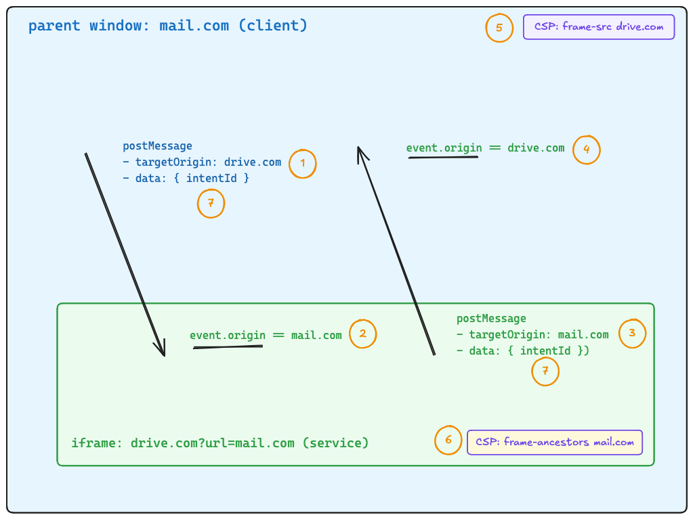

# Security

## CSP

Recommended. Good practices

No CSP (for the full chain ⇒ consumer, provider and SSO) : OK 

If CSP, it requires dynamic adding of CSP:
- provider backends read manifests and add CSP to frame-ancestors
- front end providers reads manifest and add CSP to frame-src

Same for X-Frame-Options which is deprecated.

## CORS

- hardcoded manifest: OK
- manifest backend side: OK
- manifest platform side: the platform backend must accept request from consumers and providers
- File Picker
    - download link must accept fetch from consumers

## postMessage targetOrigin

We need to specify the targetOrigin to avoid redirect etc

From consumer to provider:
- send: we know the provider url ⇒ from the manifest
- receive: we check against event.origin (trusted by browser) ⇒ from the manifest

From provider to consumer:
- first, we need to receive the caller consumer url (either postMessage init event.origin either url query string)
- we check if it is a valid consumer against a consumer manifest list, if yes ⇒ OK it become our targetOrigin, if not: CIAO

https://developer.mozilla.org/en-US/docs/Web/API/Window/postMessage#targetorigin

## Intent ID

Avoid multiple tabs issues.

## iframe sandbox

What need to be allowed in the iframe?

- if `sandbox` attribute, it may break the provider app
- `allow` must allow what is necessary:
    - `clipboard-read` `clipboard-write`
    - `geolocation`
    - `camera`
    - `microphone`

https://developer.mozilla.org/en-US/docs/Web/HTML/Reference/Elements/iframe#allow

Does the provider must explain what he needs? Not required for File Picker ?
